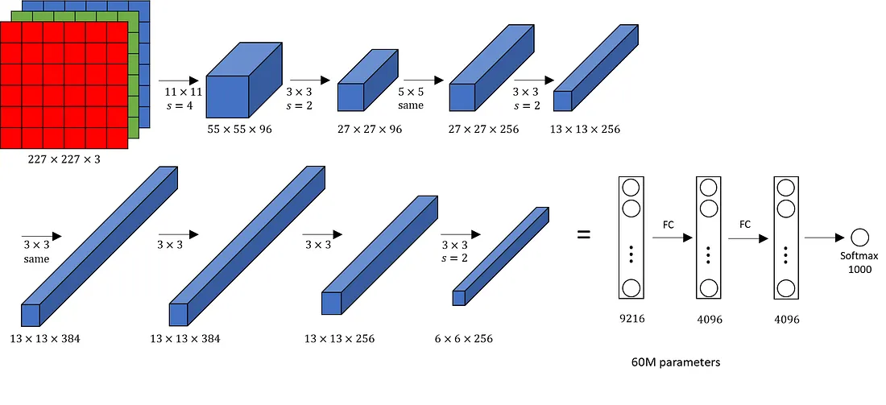

# 🏆 AlexNet - The CNN Revolution

## 📖 AlexNet কী?

> **AlexNet** হলো একটি **Deep CNN architecture**, যা ২০১২ সালে CNN-এর যুগান্তকারী সাফল্য এনে দেয়।

### 👨‍🔬 উদ্ভাবক
- **Alex Krizhevsky**
- **Ilya Sutskever**  
- **Geoffrey Hinton**

### 🎯 ঐতিহাসিক সাফল্য
**ImageNet Large Scale Visual Recognition Challenge (ILSVRC-2012)** এ বিজয়ী হয়ে আগের সব মডেলকে বিশাল ব্যবধানে পরাজিত করে।

---

## 🧠 কেন AlexNet এত গুরুত্বপূর্ণ?

| 💡 প্রভাব | বর্ণনা |
|---------|--------|
| 🎓 **Deep Learning প্রমাণ** | প্রথমবার প্রমাণিত হয় যে Deep Neural Network বড় ডেটাতে অসাধারণ কাজ করে |
| 🖥️ **GPU Revolution** | GPU ব্যবহার করে বিশাল নেটওয়ার্ক ট্রেনিং সম্ভব প্রমাণ করে |
| ⚡ **বাস্তব প্রয়োগ** | CNN শুধু তত্ত্ব নয়, বাস্তবে অত্যন্ত শক্তিশালী |
| 🚀 **DL Revolution** | Modern Deep Learning যুগের সূচনা এই মডেল থেকে |

> 💡 **এই মডেল Deep Learning-এর ইতিহাসে একটি মাইলফলক!**

---

## 🏗️ AlexNet Architecture (লেয়ার গঠন)

AlexNet মোট **8টি trainable layers** নিয়ে তৈরি:

| Layer Type | সংখ্যা |
|-----------|-------|
| Convolution Layer | 5 |
| Fully Connected Layer | 3 |

---

### 📊 Detailed Layer Breakdown

| Layer | Type | Filters | Size | Stride | Output | বিশেষত্ব |
|-------|------|---------|------|--------|--------|----------|
| 🖼️ **Input** | Image | - | 227×227 | - | 227×227×3 | RGB কালার ইমেজ |
| 1️⃣ **Conv1** | Convolution | 96 | 11×11 | 4 | 55×55×96 | ReLU, বড় filter |
| 📉 **Pool1** | Max Pooling | - | 3×3 | 2 | 27×27×96 | LRN যোগ |
| 2️⃣ **Conv2** | Convolution | 256 | 5×5 | 1 | 27×27×256 | ReLU, LRN |
| 📉 **Pool2** | Max Pooling | - | 3×3 | 2 | 13×13×256 | Feature reduce |
| 3️⃣ **Conv3** | Convolution | 384 | 3×3 | 1 | 13×13×384 | ReLU |
| 4️⃣ **Conv4** | Convolution | 384 | 3×3 | 1 | 13×13×384 | ReLU |
| 5️⃣ **Conv5** | Convolution | 256 | 3×3 | 1 | 13×13×256 | ReLU |
| 📉 **Pool3** | Max Pooling | - | 3×3 | 2 | 6×6×256 | Final pooling |
| 🔄 **Flatten** | Reshape | - | - | - | 9216 | 3D → 1D |
| 🧠 **FC1** | Dense | - | - | - | 4096 | ReLU + Dropout |
| 🧠 **FC2** | Dense | - | - | - | 4096 | ReLU + Dropout |
| 🎯 **FC3** | Output | - | - | - | 1000 | Softmax |

---

## ⚙️ Key Techniques Used in AlexNet

| 🔧 Technique | বর্ণনা | সুবিধা |
|-------------|--------|--------|
| ⚡ **ReLU Activation** | tanh/sigmoid এর পরিবর্তে ReLU ব্যবহার | Training ৬× দ্রুত হয় |
| 🎲 **Dropout (0.5)** | FC layers-এ neurons randomly বন্ধ রাখা | Overfitting কার্যকরভাবে কমায় |
| 🖥️ **GPU Training** | দুইটি NVIDIA GTX 580 GPU ব্যবহার | ৬০M parameters দ্রুত ট্রেন করা |
| 🔄 **Data Augmentation** | Flipping, Cropping, Color jittering | Dataset কৃত্রিমভাবে বড় করা |
| 📊 **LRN** | Local Response Normalization | Brightness normalization |
| 🎯 **Overlapping Pooling** | Stride < Pool size | Overfitting কমাতে সাহায্য |

---

## 📊 Performance Breakthrough

| মেট্রিক | AlexNet | Previous Best | উন্নতি |
|---------|---------|---------------|--------|
| 🏆 **Top-5 Error** | 15.3% | 26.2% | ✅ 41.6% কম |
| 🎯 **Top-1 Error** | 37.5% | 47.1% | ✅ 20.4% কম |
| 📊 **Parameters** | 60 Million | < 10M | বেশি কিন্তু কার্যকর |
| ⏱️ **Training Time** | 5-6 days | - | 2 GPUs ব্যবহার করে |

> 🎉 **ILSVRC 2012-তে দ্বিতীয় স্থানের থেকে ১০.৮% পয়েন্ট এগিয়ে বিজয়ী!**

---

## 🔍 AlexNet বনাম আধুনিক CNN

| বিষয় | AlexNet | Modern CNN |
|-------|---------|------------|
| Activation | ReLU | ReLU / Swish / GELU |
| Normalization | LRN | BatchNorm |
| Parameters | ~60 million | Optimized |
| Accuracy | কম | অনেক বেশি |

---

## 📚 AlexNet কেন এখনো পড়া হয়?

| কারণ | গুরুত্ব |
|------|--------|
| 🏛️ **Foundation** | CNN architecture বোঝার ভিত্তি |
| 📖 **ইতিহাস** | Deep Learning Revolution এর শুরু |
| 💼 **Interview** | প্রায় সব ML interview-এ আসে |
| 🔗 **Progression** | VGG, ResNet, InceptionNet বুঝতে অপরিহার্য |
| 🎓 **শিক্ষা** | DL concepts শেখার আদর্শ উদাহরণ |

---

## 📝 Exam-Friendly Short Definition

> 🎯 **AlexNet হলো একটি deep convolutional neural network architecture, যা ২০১২ সালে ImageNet challenge জিতে CNN-এর জনপ্রিয়তা বহুগুণ বাড়িয়ে দেয় এবং Modern Deep Learning যুগের সূচনা করে।**

---

## 🖼️ AlexNet Architecture Diagram



### 📐 Key Statistics

```
🔢 Total Parameters:    ~60 Million
📊 Total Layers:         8 (5 Conv + 3 FC)
🖼️ Input Size:          227 × 227 × 3
🎯 Output Classes:      1000 (ImageNet)
💾 Model Size:          ~240 MB
⚡ Activation:          ReLU throughout
🎲 Regularization:      Dropout (0.5)
```

---

## 🔍 Layer-by-Layer বিস্তারিত বিশ্লেষণ

### 🟥 1️⃣ Input Image

```
📐 Dimension: 227 × 227 × 3
```

| Component | Value | বর্ণনা |
|-----------|-------|--------|
| Height | 227 | ইমেজের উচ্চতা |
| Width | 227 | ইমেজের প্রস্থ |
| Channels | 3 | RGB (Red, Green, Blue) |

💡 **কালার ছবি CNN-এ ইনপুট হিসেবে প্রবেশ করছে**

---

### 🟦 2️⃣ Convolution Layer–1

| Parameter | Value |
|-----------|-------|
| 🔲 Filter Size | 11 × 11 |
| 👟 Stride | 4 |
| 📊 Filters | 96 |
| 📐 Output | 55 × 55 × 96 |
| ⚡ Activation | ReLU |

**🎯 Purpose:**
- ✅ বড় filter দিয়ে computation কমানো
- ✅ Low-level features ধরা (edges, color blobs)
- ✅ বড় receptive field তৈরি করা

---

### 📉 3️⃣ Max Pooling–1 + LRN

| Parameter | Value |
|-----------|-------|
| 🔲 Pool Size | 3 × 3 |
| 👟 Stride | 2 |
| 📐 Output | 27 × 27 × 96 |
| 🔬 Extra | Local Response Normalization |

**🎯 কাজ:**
- ✅ Spatial size কমানো
- ✅ Important features রাখা
- ✅ Translation invariance বাড়ানো

---

### 🟦 4️⃣ Remaining Convolution Layers

| Layer | Filter | Filters | Output | শেখে |
|-------|--------|---------|--------|------|
| **Conv2** | 5×5 | 256 | 27×27×256 | Textures, shapes |
| **Pool2** | 3×3 | - | 13×13×256 | Dimensionality কমানো |
| **Conv3** | 3×3 | 384 | 13×13×384 | Complex patterns |
| **Conv4** | 3×3 | 384 | 13×13×384 | Object parts |
| **Conv5** | 3×3 | 256 | 13×13×256 | High-level features |
| **Pool3** | 3×3 | - | 6×6×256 | Final compression |

**📈 Feature Progression:**
```
Edges → Textures → Shapes → Parts → Objects
```

---

### 🔄 5️⃣ Flatten Layer

```
6 × 6 × 256 = 9,216 neurons
3D Feature Maps → 1D Vector
```

---

### 🧠 6️⃣ Fully Connected Layers

| Layer | Neurons | Activation | Regularization | কাজ |
|-------|---------|------------|----------------|-----|
| **FC1** | 4,096 | ReLU | Dropout (0.5) | High-level reasoning |
| **FC2** | 4,096 | ReLU | Dropout (0.5) | Feature combination |
| **FC3** | 1,000 | Softmax | - | Class probabilities |

**🎯 Final Output:**
```
1000 classes এর জন্য probability distribution
```

> 💡 **FC layers গ্লোবাল understanding তৈরি করে এবং final classification করে**

---

## 💡 AlexNet থেকে মূল শিক্ষা

| শিক্ষা | বিবরণ |
|--------|-------|
| 🎯 **Feature Hierarchy** | CNN কীভাবে simple → complex features শেখে |
| 📊 **Scale Matters** | বড় model + বড় data = ভালো performance |
| 🖥️ **Hardware Impact** | GPU training বড় মডেল সম্ভব করেছে |
| 🎲 **Regularization** | Dropout overfitting রোধে কার্যকর |
| 🔄 **Data Augmentation** | Limited data এর সমাধান |

---

## 📌 চূড়ান্ত সারাংশ

> ### 🎓 **এক বাক্যে AlexNet**
> **AlexNet প্রমাণ করেছে যে deep CNN, GPU computing, এবং clever regularization একসাথে ব্যবহার করে কম্পিউটার ভিশনে যুগান্তকারী ফলাফল অর্জন সম্ভব—যা আজকের সব modern architecture এর ভিত্তি।**


---

*📅 Last Updated: January 2026*
