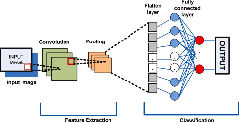

# CNN (Convolutional Neural Network) কী?

## 1. CNN কী?

**CNN (Convolutional Neural Network)** হলো
একটি বিশেষ ধরনের **Deep Learning Neural Network**
যা মূলত **image, video, spatial data** নিয়ে কাজ করার জন্য তৈরি।

👉 CNN মানুষের চোখ যেভাবে ছবি দেখে,
👉 সেই ধারণা থেকে অনুপ্রাণিত হয়ে বানানো হয়েছে।

📌 CNN সবচেয়ে বেশি ব্যবহৃত হয়:

* Image Classification
* Object Detection
* Face Recognition
* Medical Image Analysis
* Self-driving cars

---

## 2. CNN কেন দরকার? (Why CNN?)

ধরা যাক, একটি ছবির size = `224 × 224 × 3`

👉 যদি আমরা **Fully Connected Neural Network** ব্যবহার করি:

* Parameter সংখ্যা হবে লক্ষ লক্ষ
* Training slow হবে
* Overfitting হবে

📌 CNN এখানে সমাধান দেয়:

* Parameter কমায়
* Spatial pattern ধরে
* Feature automatically শেখে

---

## 3. CNN কীভাবে কাজ করে? (High-level Idea)

CNN ধাপে ধাপে কাজ করে:

1. Image input নেয়
2. Feature extract করে
3. Important information রাখে
4. শেষে classification করে

👉 CNN **নিজে নিজে feature শিখে**,
manual feature engineering লাগে না।

---



---

## 4. CNN-এর মূল Components

CNN প্রধানত ৫টি অংশ নিয়ে গঠিত:

---

## 4.1 Convolutional Layer

### কাজ কী?

* Image থেকে **feature বের করা**
* যেমন: edge, corner, texture

### কীভাবে?

* Image-এর উপর একটি ছোট matrix (filter/kernel) slide করে
* Dot product করে feature map তৈরি করে

📌 Example:

* Vertical edge detector
* Horizontal edge detector

👉 এটিই CNN-এর **সবচেয়ে গুরুত্বপূর্ণ layer**

---

## 4.2 Filter / Kernel কী?

* Filter হলো একটি ছোট matrix (যেমন 3×3, 5×5)
* এটি image-এর নির্দিষ্ট pattern ধরতে শেখে

উদাহরণ:

* Edge filter
* Blur filter

📌 Filter-এর মান training-এর সময় **learn হয়**

---

## 4.3 Feature Map কী?

* Convolution করার পর যে output পাওয়া যায়
* সেটাকেই বলে **Feature Map**

👉 একেকটা feature map একেক ধরনের feature বোঝায়

---

## 4.4 Stride

* Filter কত ঘর করে move করবে
* Stride বেশি → output ছোট
* Stride কম → output বড়

---

## 4.5 Padding

Padding মানে image-এর চারপাশে extra pixel যোগ করা

### কেন দরকার?

* Image size কমে যাওয়া আটকাতে
* Border information হারানো আটকাতে

প্রকার:

* Valid padding (padding নেই)
* Same padding (output size = input size)

---

## 4.6 Activation Function (ReLU)

Convolution-এর পরে ব্যবহার হয়

```text
ReLU(x) = max(0, x)
```

👉 Negative value বাদ দেয়
👉 Network-কে non-linear করে

---

## 4.7 Pooling Layer

### কাজ কী?

* Feature map-এর size ছোট করা
* Important information রাখা

### সবচেয়ে জনপ্রিয়:

* **Max Pooling (2×2)**

👉 Computation কমায়
👉 Overfitting কমায়

---

## 4.8 Fully Connected (FC) Layer

* CNN-এর শেষ অংশ
* Extracted feature নিয়ে final decision নেয়

👉 এখানে classification হয় (Softmax ব্যবহার করে)

---

## 5. CNN-এর Architecture (Simple Flow)

```
Input Image
   ↓
Convolution
   ↓
ReLU
   ↓
Pooling
   ↓
Convolution
   ↓
ReLU
   ↓
Pooling
   ↓
Fully Connected
   ↓
Output (Class)
```

---

## 6. CNN কেন এত Powerful?

✅ Automatic feature extraction
✅ Parameter sharing
✅ Translation invariance
✅ Less computation
✅ High accuracy

---

## 7. CNN vs Fully Connected NN

| বিষয় | CNN | Fully Connected |
|-------|-----|----------------|
| Image handling | Excellent | Poor |
| Parameter | কম | অনেক |
| Feature learning | Automatic | Manual |
| Spatial info | ধরে রাখে | হারায় |

---

## 8. Real-Life Example (সহজ উদাহরণ)

### মানুষের চোখ 🧠👁️

* প্রথমে edge দেখে
* তারপর shape
* তারপর object চিনে

👉 CNN ঠিক এইভাবেই কাজ করে:

* First layer → edge
* Middle layer → shape
* Last layer → object

---

## 9. CNN কোথায় ব্যবহার হয়?

* Face recognition
* Medical image (X-ray, MRI)
* Skin cancer detection
* Traffic sign detection
* OCR (handwritten digit recognition)

---

## 10. CNN-এর Limitations

❌ Training data বেশি লাগে
❌ Computationally expensive
❌ Explain করা কঠিন (Black box)

---

## 11. Short Summary

* CNN হলো image-based deep learning model
* Feature নিজে নিজে শেখে
* Convolution + Pooling = Core strength
* Computer Vision-এর backbone

---

