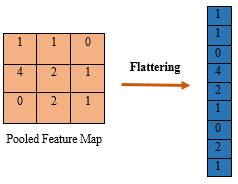

# Flatten কী? (Deep Learning)

## 1️⃣ Flatten মানে কী?

**Flatten** মানে হলো—

> **Multi-dimensional data (2D / 3D) কে 1D vector-এ রূপান্তর করা**

📌 Deep Learning–এ সাধারণত
**Convolution / Pooling layer-এর output → Fully Connected layer-এ দেওয়ার আগে flatten করতে হয়।**

---

## 2️⃣ Flatten কেন দরকার?

### কারণ:

* **Fully Connected (Dense) layer শুধু 1D input নিতে পারে**
* কিন্তু Convolution layer-এর output হয় **2D বা 3D**

👉 তাই মাঝখানে **Flatten layer** ব্যবহার করা হয়।

---



---

## 3️⃣ Flatten কীভাবে কাজ করে?

ধরি একটি feature map:

```
4 × 4 × 3
```

Flatten করার পর হবে:

```
4 × 4 × 3 = 48
```

➡ Output shape:

```
(48,)
```

📌 শুধু shape বদলায়
📌 কোনো value change হয় না
📌 কোনো learning নেই (no parameter)

---

## 4️⃣ Example (Simple)

### Before Flatten:

```
Feature Map:
[
 [[1,2],[3,4]],
 [[5,6],[7,8]]
]
Shape: 2×2×2
```

### After Flatten:

```
[1,2,3,4,5,6,7,8]
Shape: (8,)
```

---

## 5️⃣ CNN Architecture-এ Flatten কোথায় বসে?

```
Input Image
 ↓
Convolution
 ↓
Pooling
 ↓
Flatten  ← এখানে
 ↓
Fully Connected
 ↓
Output
```

---

## 6️⃣ Flatten vs Pooling (Confusion Clear)

| বিষয়       | Flatten      | Pooling           |
| ---------- | ------------ | ----------------- |
| কাজ        | Shape change | Size reduce       |
| Learn করে? | না           | না                |
| Parameter  | 0            | 0                 |
| Data loss  | না           | হ্যাঁ (some info) |

---

## 7️⃣ Keras Example

```python
from tensorflow.keras.models import Sequential
from tensorflow.keras.layers import Conv2D, MaxPooling2D, Flatten, Dense

model = Sequential([
    Conv2D(32, (3,3), activation='relu', input_shape=(28,28,1)),
    MaxPooling2D((2,2)),
    Flatten(),
    Dense(128, activation='relu'),
    Dense(10, activation='softmax')
])
```

---

## 8️⃣ Real-Life Analogy

🧩 **Puzzle analogy**

* CNN → ছবির টুকরো টুকরো feature দেখে
* Flatten → সব টুকরো এক লাইনে সাজায়
* Dense layer → সিদ্ধান্ত নেয়

---

## 9️⃣ Exam One-Liners

* Flatten converts multi-dimensional tensor into 1D vector
* Flatten has **no trainable parameters**
* Used before Fully Connected layers
* Does not change data values

---

## 🔥 Summary

* Flatten = shape transformer
* CNN → FC bridge
* Mandatory for Dense layers
* Simple but critical

---

