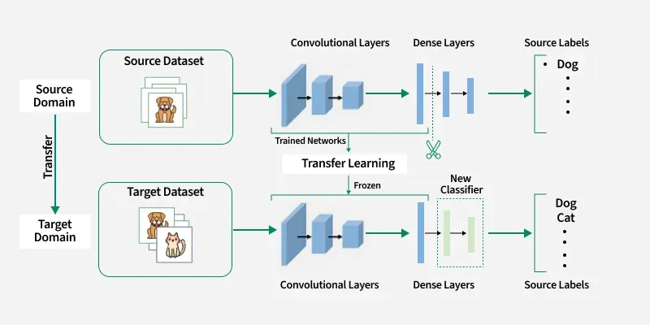

## 🧠 CNN-এ **Transfer Learning** কী? — বিস্তারিত ব্যাখ্যা

**Transfer Learning** হলো Deep Learning-এর একটি শক্তিশালী কৌশল, যেখানে
👉 **আগে শেখানো (pretrained) একটি CNN মডেলের জ্ঞান নতুন কাজে ব্যবহার করা হয়।**

সহজভাবে বললে—

> **এক জায়গায় শেখা জ্ঞান আরেক জায়গায় কাজে লাগানোই Transfer Learning।**

---

## 🔷 সহজ উদাহরণ (Real Life Analogy)

ধরো তুমি—

* আগে ইংরেজি শিখেছ
* এখন জার্মান শিখছ

👉 ইংরেজির grammar sense, vocabulary learning skill—সব কাজে লাগছে।

ঠিক তেমনই—

* CNN আগে **ImageNet** দিয়ে শেখে
* পরে তোমার **নিজের ছোট dataset**-এ কাজে লাগে

---

## 🔍 CNN-এ Transfer Learning কীভাবে কাজ করে?

### 🔹 Step-1: Pretrained Model নেওয়া

যেমন:

* **AlexNet**
* **VGG16 / VGG19**
* **ResNet**
* **Inception**
* **MobileNet**

এগুলো আগেই লাখ লাখ ছবিতে train করা।

---

### 🔹 Step-2: Feature Reuse

CNN-এর বিভিন্ন layer যা শেখে:

| Layer        | শেখে কী        |
| ------------ | -------------- |
| Early layer  | Edge, color    |
| Middle layer | Texture, shape |
| Deep layer   | Object parts   |

👉 এই feature গুলো **সব ছবিতেই common**

---
## 🖼️ Transfer Learning Architecture Diagram

---

### 🔹 Step-3: Old Classifier বাদ দেওয়া

Pretrained model-এর শেষের:

* Fully Connected
* Softmax (1000 class)

❌ বাদ দেওয়া হয়

---

### 🔹 Step-4: New Classifier যোগ করা

ধরো তোমার কাজ:

* Skin disease detection
* Cat vs Dog
* Plant disease

👉 নতুন FC + Softmax layer যোগ করা হয়

---

### 🔹 Step-5: Training Strategy

দুইভাবে করা হয় 👇

---

## ⚙️ Transfer Learning করার ২টা পদ্ধতি

---

### ✅ 1️⃣ Feature Extraction (Freeze)

* CNN-এর convolution layer **freeze**
* শুধু নতুন classifier train

📌 কখন ব্যবহার করবে?

* Dataset ছোট
* Dataset pretrained data-এর মতো

---

### ✅ 2️⃣ Fine Tuning

* কিছু top convolution layer **unfreeze**
* নতুন data দিয়ে retrain

📌 কখন ব্যবহার করবে?

* Dataset একটু বড়
* Task ভিন্ন (medical, satellite image)

---

## 🧮 Example Scenario

### 🎯 Task:

Skin cancer detection

### Dataset:

2000 images (ছোট)

❌ From scratch train → overfitting
✅ Transfer learning → ভালো accuracy

---

## 📊 Transfer Learning কেন এত জনপ্রিয়?

| কারণ           | ব্যাখ্যা                     |
| -------------- | ---------------------------- |
| কম ডেটা লাগে   | লাখ লাখ ছবি দরকার হয় না      |
| Training fast  | কয়েক মিনিট/ঘণ্টা             |
| Accuracy বেশি  | Pretrained feature শক্তিশালী |
| Overfitting কম | Model আগে থেকেই smart        |

---

## 🔬 AlexNet-এ Transfer Learning উদাহরণ

* AlexNet trained on ImageNet (1000 class)
* Conv layers reuse
* FC layers replace
* New task train

---

## 🧠 Exam-Friendly Definition

> **Transfer Learning হলো একটি পদ্ধতি যেখানে একটি pretrained CNN model-এর শেখা feature নতুন classification বা detection সমস্যায় পুনরায় ব্যবহার করা হয়।**

---

## ⚠️ কখন Transfer Learning কাজ নাও করতে পারে?

* Dataset খুব আলাদা হলে
  (Natural image → X-ray)
* Domain gap বেশি হলে

👉 তখন **fine-tuning দরকার**

---

## 🧪 CNN From Scratch vs Transfer Learning

| বিষয়     | From Scratch | Transfer Learning |
| -------- | ------------ | ----------------- |
| Data     | অনেক লাগে    | কম লাগে           |
| Time     | বেশি         | কম                |
| Risk     | Overfitting  | কম                |
| Hardware | শক্তিশালী    | মাঝারি            |

---

## 📝 Viva / Interview Question Tip

❓ *Why transfer learning is effective in CNN?*
👉 **Because early CNN layers learn general visual features that are reusable across tasks.**

---

## 🧠 এক লাইনে মনে রাখো

> **Don’t train everything again — reuse intelligence.**

---
