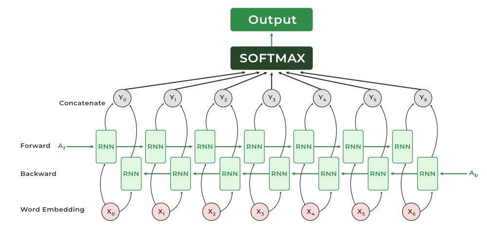

# 🔁 Bidirectional RNN (BiRNN) কী?

**Bidirectional RNN** হলো এমন এক ধরনের Recurrent Neural Network,
যেখানে **sequence ডাটা দুই দিক থেকে (forward + backward)** প্রসেস করা হয়।

📌 সাধারণ RNN:

* শুধু **past → present** দেখে

📌 Bidirectional RNN:

* **past → present → future** — দুই দিকের context দেখে

---

## 🔹 কেন Bidirectional দরকার?

অনেক সময় কোনো শব্দ/ডাটার মানে বুঝতে **আগের তথ্যই নয়, পরের তথ্যও দরকার হয়**।

### উদাহরণ:

> **“আমি ব্যাংকে টাকা রাখলাম”**

এখানে **“ব্যাংক”** শব্দটা:

* আগে কী আছে → গুরুত্বপূর্ণ
* পরে **“টাকা”** আছে → আরও গুরুত্বপূর্ণ

👉 সাধারণ RNN শুধু আগের শব্দ দেখে
👉 BiRNN আগের **এবং পরের** শব্দ দুইটাই দেখে

---

# 🧠 BiRNN কীভাবে কাজ করে?

BiRNN–এ **দুটি RNN layer থাকে**:

### 1️⃣ Forward RNN

* Sequence পড়ে:
  **x₁ → x₂ → x₃ → … → xₜ**

### 2️⃣ Backward RNN

* Sequence পড়ে উল্টোভাবে:
  **xₜ → xₜ₋₁ → … → x₁**

📌 প্রতিটি time step–এ:

* Forward hidden state: **hₜ→**
* Backward hidden state: **hₜ←**

👉 দুইটাকে **concatenate / sum** করে final output বানানো হয়।

---

## 🔢 Mathematical idea (সহজভাবে)

ধরা যাক ইনপুট sequence:

$$X = (x_1, x_2, \ldots, x_T)$$

### Forward pass:

$$\overrightarrow{h_t} = f(W_f x_t + U_f \overrightarrow{h_{t-1}})$$

### Backward pass:

$$\overleftarrow{h_t} = f(W_b x_t + U_b \overleftarrow{h_{t+1}})$$

### Final hidden state:

$$h_t = [\overrightarrow{h_t} ; \overleftarrow{h_t}]$$

📌 `[ ; ]` মানে **concatenation**

---



---

# 🆚 Normal RNN vs Bidirectional RNN

| বিষয়       | Normal RNN      | Bidirectional RNN |
| ---------- | --------------- | ----------------- |
| Direction  | এক দিক          | দুই দিক           |
| Context    | শুধু past       | past + future     |
| Accuracy   | কম              | বেশি              |
| Complexity | কম              | বেশি              |
| Use case   | simple sequence | language, speech  |

---

# 🔁 BiRNN vs BiLSTM vs BiGRU

📌 BiRNN আসলে একটা **framework**
এর ভেতরে থাকতে পারে:

| Model  | Description        |
| ------ | ------------------ |
| BiRNN  | Vanilla RNN        |
| BiLSTM | Bidirectional LSTM |
| BiGRU  | Bidirectional GRU  |

👉 বাস্তবে **BiLSTM / BiGRU বেশি ব্যবহৃত হয়**
কারণ vanilla RNN–এ vanishing gradient সমস্যা থাকে।

---

# 🌍 Real Life Use Cases

### 1️⃣ Natural Language Processing (NLP)

* POS tagging
* Named Entity Recognition (NER)
* Machine Translation

📌 কারণ:
একটা শব্দের মানে আগে–পরে দুই দিকেই নির্ভর করে।

---

### 2️⃣ Speech Recognition 🎤

* শব্দ বোঝার জন্য আগের ও পরের sound দরকার

---

### 3️⃣ Handwriting Recognition ✍️

* আগের অক্ষর + পরের অক্ষর দেখে সঠিক character চিনে

---

### 4️⃣ DNA Sequence Analysis 🧬

* জিনের pattern দুই দিকেই গুরুত্বপূর্ণ

---

# 🧪 Keras Example (BiLSTM)

```python
from tensorflow.keras.models import Sequential
from tensorflow.keras.layers import Bidirectional, LSTM, Dense

model = Sequential()
model.add(Bidirectional(
    LSTM(128, return_sequences=True),
    input_shape=(100, 64)
))
model.add(Dense(1, activation='sigmoid'))

model.compile(
    optimizer='adam',
    loss='binary_crossentropy',
    metrics=['accuracy']
)
```

📌 এখানে:

* `Bidirectional()` → forward + backward
* `return_sequences=True` → sequence output দেয়

---

# ⚠️ Limitations of Bidirectional RNN

❌ Real-time prediction–এ সমস্যা

* Future data দরকার → live stream–এ সম্ভব নয়

❌ Computational cost বেশি

* দুইটা RNN train হয়

❌ Memory usage বেশি

---

# 🧠 কখন Bidirectional ব্যবহার করব?

✅ যদি:

* পুরো sequence আগে থেকেই জানা থাকে
* Accuracy খুব গুরুত্বপূর্ণ
* NLP / Speech / Bioinformatics কাজ

❌ যদি:

* Real-time system
* Streaming data

---

# 📌 Exam / Viva Key Points

✔ Bidirectional RNN processes data in both directions
✔ Captures past and future context
✔ Uses two RNNs (forward + backward)
✔ Often implemented using LSTM/GRU
✔ Not suitable for real-time applications

---

