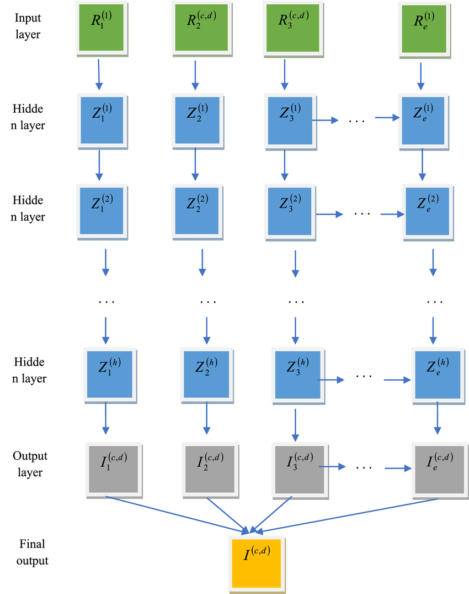
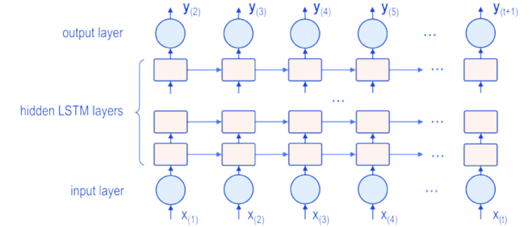

# 🧠 Deep RNN কী?

**Deep RNN** হলো এমন একটি **Recurrent Neural Network**, যেখানে
➡️ **একটির বেশি recurrent layer (RNN/LSTM/GRU)** একটার উপর একটা **stack করে** বসানো হয়।

📌 সহজ ভাষায়:

* Normal RNN → **১টা recurrent layer**
* **Deep RNN → ২টা বা তার বেশি recurrent layer**

---

# 🔁 আগে RNN মনে করি (খুব সংক্ষেপে)

RNN এমন এক ধরনের neural network যা:

* **sequence data** নিয়ে কাজ করে
* **past information (memory)** মনে রাখতে পারে

📌 উদাহরণ:

* Sentence
* Time series
* Audio
* Stock price

---

# 🔥 Deep RNN কেন দরকার?

**Single-layer RNN-এর সীমাবদ্ধতা:**

1. জটিল pattern ঠিকমতো ধরতে পারে না
2. long sequence হলে performance কমে যায়
3. high-level feature শেখা কঠিন

📌 সমাধান → **Deep RNN**

---

# 🧩 Deep RNN-এর মূল ধারণা

একাধিক RNN layer থাকলে:

* **Lower layer** → simple pattern শেখে
* **Middle layer** → contextual pattern শেখে
* **Upper layer** → high-level abstract pattern শেখে

📌 ঠিক CNN-এর মতো:

> CNN-এ যেমন depth বাড়ালে feature rich হয়
> Deep RNN-এও depth বাড়ালে **temporal feature rich হয়**

---

# 🧱 Deep RNN-এর Architecture

ধরি 3-layer Deep RNN:

```
Input Sequence
      ↓
RNN Layer 1
      ↓
RNN Layer 2
      ↓
RNN Layer 3
      ↓
Output
```

⏱️ প্রতিটা time step-এ:

* নিচের layer-এর output → উপরের layer-এর input

---

# 🧮 Mathematical View (intuition level)

ধরি,

* xₜ = input at time t
* hₜˡ = hidden state at layer l

তাহলে,

**Layer 1:**

$$h_t^1 = f(W^1 \cdot x_t + U^1 \cdot h_{t-1}^1)$$

**Layer 2:**

$$h_t^2 = f(W^2 \cdot h_t^1 + U^2 \cdot h_{t-1}^2)$$

📌 প্রতিটা layer:

* নিজের **past state**
* নিচের layer-এর **current output**

→ একসাথে ব্যবহার করে

---



---
# 🧠 Deep RNN vs Normal RNN

| বিষয়                | Normal RNN | Deep RNN       |
| ------------------- | ---------- | -------------- |
| Recurrent layer     | ১টা        | একাধিক         |
| Model capacity      | কম         | বেশি           |
| Complex pattern     | দুর্বল     | শক্তিশালী      |
| Training difficulty | সহজ        | তুলনামূলক কঠিন |
| Overfitting risk    | কম         | বেশি           |

---

# ⚠️ Deep RNN-এর সমস্যা

1️⃣ **Vanishing / Exploding Gradient**
2️⃣ Training ধীর
3️⃣ Overfitting হওয়ার সম্ভাবনা
4️⃣ বেশি data দরকার

📌 এজন্যই বাস্তবে:

* **Deep LSTM**
* **Deep GRU**

বেশি ব্যবহার হয়

---

# 🔁 Deep LSTM / Deep GRU

Deep RNN মানেই সব সময় vanilla RNN না।

👉 Layer হিসেবে ব্যবহার করা যায়:

* LSTM
* GRU

📌 Example:

```
LSTM (layer 1)
   ↓
LSTM (layer 2)
   ↓
LSTM (layer 3)
```

এগুলো:

* long-term dependency ভালোভাবে ধরে
* gradient problem কমায়



---

# 🌍 Real-Life Example

### 📝 Sentence Understanding

Sentence:

> “I am learning deep learning”

* Layer 1 → শব্দ চিনে
* Layer 2 → শব্দের context বুঝে
* Layer 3 → sentence-এর meaning বুঝে

---

### 📈 Time Series (Stock Price)

* Layer 1 → short-term fluctuation
* Layer 2 → weekly trend
* Layer 3 → long-term trend

---

# 🧪 Keras উদাহরণ (Concept বোঝার জন্য)

```python
model = Sequential()
model.add(SimpleRNN(64, return_sequences=True))
model.add(SimpleRNN(64, return_sequences=True))
model.add(SimpleRNN(32))
model.add(Dense(1))
```

📌 এখানে:

* 3টা RNN layer → **Deep RNN**
* `return_sequences=True` না দিলে next layer sequence পায় না

---

# 🎯 কখন Deep RNN ব্যবহার করবো?

- ✔ Complex sequence data
- ✔ Long time dependency
- ✔ NLP, Speech, Forecasting
- ✔ যখন shallow RNN ভালো কাজ করছে না

---

# 🧠 Exam-ready সংজ্ঞা (মনে রাখো)

> **Deep RNN হলো এমন একটি Recurrent Neural Network যেখানে একাধিক recurrent layer একসাথে stack করে temporal ও hierarchical features শেখানো হয়।**

---

