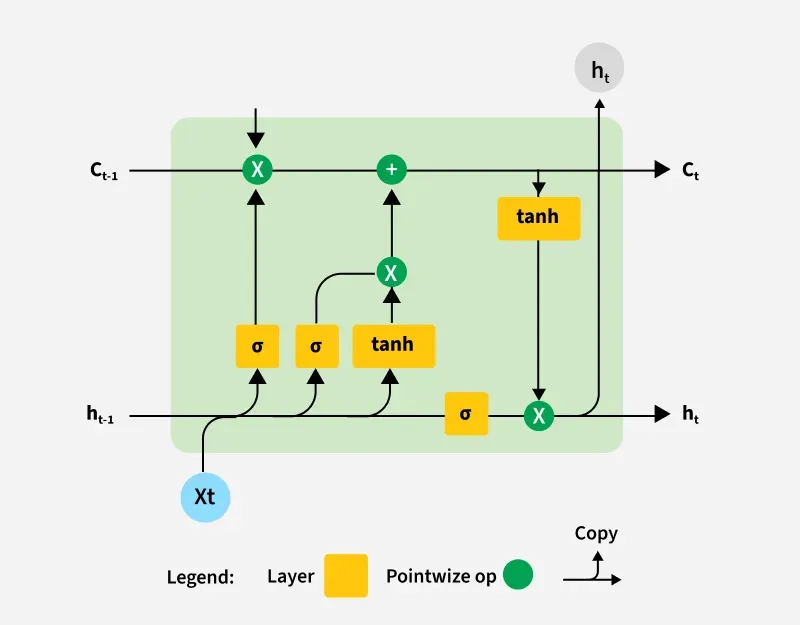
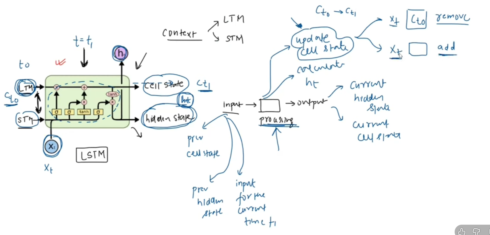
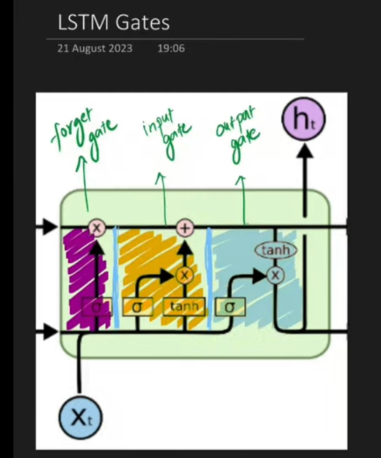
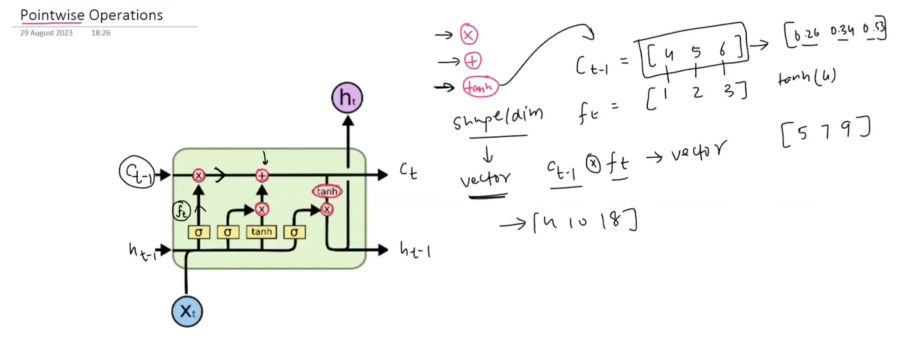
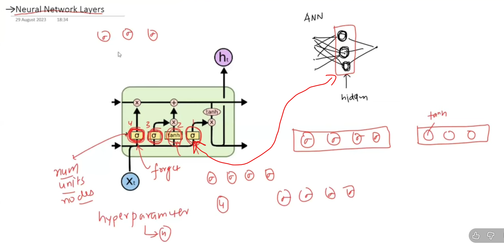

# 🧠 RNN কী? (ছোট রিক্যাপ)

**RNN (Recurrent Neural Network)** এমন এক ধরনের Neural Network যা
👉 **sequence data** নিয়ে কাজ করে

📌 Sequence data মানে:

* সময় অনুযায়ী ডাটা (Time series)
* বাক্য / sentence
* Speech
* Stock price
* Sensor data

### RNN কীভাবে কাজ করে?

RNN আগের output বা hidden state মনে রেখে পরের input প্রসেস করে।

ফর্মুলা:
$$h_t = f(W_x x_t + W_h h_{t-1})$$

📉 **সমস্যা:**
RNN দীর্ঘ সময়ের তথ্য (long-term dependency) মনে রাখতে পারে না
➡️ **Vanishing Gradient Problem**

---

# 🚨 RNN-এর মূল সমস্যা (Very Important)

ধরা যাক একটি বাক্য:

> “আমি গতকাল যে সিনেমাটা দেখেছিলাম, সেটি খুব ভালো ছিল”

শেষে “ভালো” বোঝার জন্য **শুরুর তথ্য** দরকার।
কিন্তু সাধারণ RNN এত দূরের তথ্য ভুলে যায় 😕

📌 কারণ:

* Gradient বারবার multiply হয়ে ছোট হয়ে যায়
* পুরনো তথ্য হারিয়ে যায়

---

# 🧠 LSTM কী?

**LSTM (Long Short-Term Memory)** হলো
👉 RNN-এর একটি **উন্নত (advanced) version**

📌 এটি বিশেষভাবে তৈরি করা হয়েছে:

* **Long-term memory ধরে রাখার জন্য**
* Vanishing gradient problem সমাধান করতে

👉 LSTM মনে করতে পারে:

* **কোন তথ্য রাখবে**
* **কোন তথ্য ভুলে যাবে**
* **কোন তথ্য এখন ব্যবহার করবে**

---

# 🏗️ LSTM-এর গঠন (Architecture)

একটি LSTM cell-এর ভিতরে থাকে:

1️⃣ **Cell State (Cₜ)**
2️⃣ **Hidden State (hₜ)**
3️⃣ **৩টি Gate**

---

---
## 🔹 Cell State কী?

Cell State হলো:
👉 LSTM-এর **long-term memory highway**

* তথ্য প্রায় সরাসরি flow করে
* অপ্রয়োজনীয় তথ্য gate দিয়ে কেটে ফেলা হয়

---

# 🚪 LSTM-এর ৩টি Gate (সবচেয়ে গুরুত্বপূর্ণ অংশ)

---

## 1️⃣ Forget Gate ❌

**প্রশ্ন:** কোন পুরনো তথ্য ভুলে যাবো?

ফর্মুলা:
$$f_t = \sigma(W_f [h_{t-1}, x_t] + b_f)$$

📌 Output:

* 0 → পুরোপুরি ভুলে যাও
* 1 → পুরোপুরি মনে রাখো

🔍 উদাহরণ:

* পুরনো topic শেষ → ভুলে যাও
* Context দরকার → রেখে দাও

---

## 2️⃣ Input Gate ✍️

**প্রশ্ন:** নতুন কোন তথ্য যোগ করবো?

দুই ধাপ:
$$i_t = \sigma(W_i [h_{t-1}, x_t] + b_i)$$
$$\tilde{C}_t = \tanh(W_c [h_{t-1}, x_t] + b_c)$$

📌 কাজ:

* নতুন তথ্য তৈরি করে
* ঠিক করে কতটুকু সংরক্ষণ হবে

---
## 3️⃣ Update Cell State 🔄

$$C_t = f_t \cdot C_{t-1} + i_t \cdot \tilde{C}_t$$

📌 এখানে:

* পুরনো দরকারি তথ্য থাকে
* নতুন দরকারি তথ্য যোগ হয়

---

--- 
## 4️⃣ Output Gate 📤

**প্রশ্ন:** এখন কোন তথ্য output দিবো?

$$o_t = \sigma(W_o [h_{t-1}, x_t] + b_o)$$
$$h_t = o_t \cdot \tanh(C_t)$$

📌 hₜ = বর্তমান output + short-term memory

---

# 🔁 পুরো LSTM এক লাইনে

👉 **Forget → Add → Update → Output**

---

## 📹 LSTM Visualization Video

<video width="600" controls>
  <source src="../../Images/LSTM.mp4" type="video/mp4">
  Your browser does not support the video tag.
</video>

---
---

# Extra

---

# ⚔️ RNN বনাম LSTM (Difference Table)

| বিষয়               | RNN          | LSTM                 |
| ------------------ | ------------ | -------------------- |
| Long-term memory   | ❌ দুর্বল     | ✅ খুব ভালো           |
| Vanishing gradient | ❌ সমস্যা আছে | ✅ প্রায় নেই          |
| Structure          | Simple       | Complex (Gate-based) |
| Gates              | নেই          | 3টি gate             |
| Computation        | দ্রুত        | একটু ধীর             |
| Accuracy           | কম           | বেশি                 |
| বাস্তব ব্যবহার     | কম           | বেশি                 |

---

# 🎯 বাস্তব উদাহরণ (Real Life Analogy)

### 🧠 RNN = সাধারণ মানুষ

* কয়েক মিনিট আগের কথা ভুলে যায়

### 🧠 LSTM = ভালো নোট নেওয়া ছাত্র

* দরকারি কথা লিখে রাখে
* অপ্রয়োজনীয় কথা বাদ দেয়
* পরীক্ষার সময় দরকারি অংশ ব্যবহার করে

---

# 📌 কোথায় LSTM ব্যবহার হয়?

* 🔤 Machine Translation
* 🎙️ Speech Recognition
* 📝 Text Generation
* 📈 Stock Price Prediction
* 🧬 Bioinformatics
* 💬 Chatbots

---

# 🧪 সংক্ষেপে এক লাইনে

> **LSTM হলো এমন এক ধরনের RNN, যা gate ব্যবহার করে দীর্ঘ সময়ের তথ্য স্মার্টভাবে মনে রাখতে পারে।**

---
