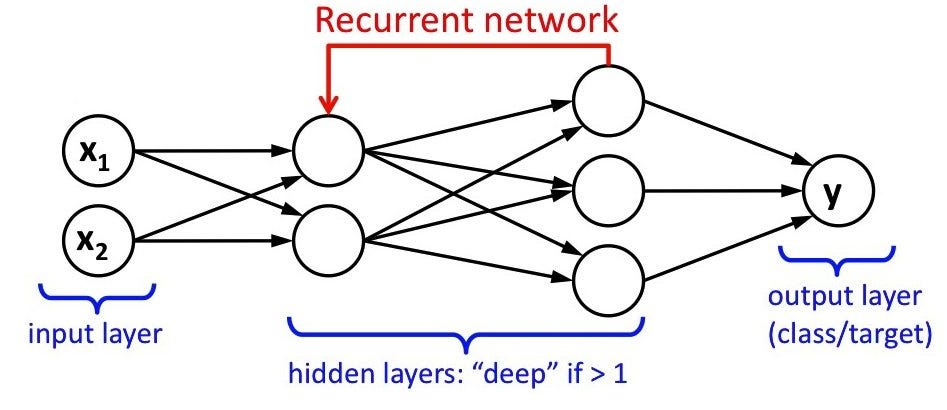
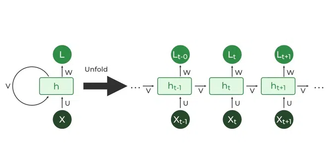

## 1️⃣ RNN মানে কী?

**RNN = Recurrent Neural Network**  
বাংলায়: **পুনরাবৃত্তি নিউরাল নেটওয়ার্ক**

RNN হলো এমন এক ধরনের **নিউরাল নেটওয়ার্ক**, যা **সিকোয়েন্সিয়াল ডেটা (Sequence Data)** বা **ক্রমাগত ডেটা**–কে প্রক্রিয়াকরণে বিশেষভাবে ভালো।

* অর্থাৎ যেকোনো ডেটা যেটার **ক্রম (sequence) গুরুত্বপূর্ণ**, যেমন:

  * টেক্সট (শব্দের ক্রম)
  * অডিও (সঙ্গীত বা স্পিচ)
  * ভিডিও (ফ্রেমের ক্রম)
  * টাইম সিরিজ ডেটা (শেয়ারের দাম, তাপমাত্রা ইত্যাদি)

RNN-এর মূল বৈশিষ্ট্য হলো **পুরানো ইনফরমেশন মনে রাখা এবং ভবিষ্যতের প্রেডিকশনে ব্যবহার করা**।

---

## 2️⃣ সাধারণ নিউরাল নেটওয়ার্ক বনাম RNN

| Feature    | সাধারণ Neural Network              | RNN                             |
| ---------- | ---------------------------------- | ------------------------------- |
| Input Data | Independent                        | Sequential / Time-dependent     |
| Memory     | None                               | Has memory (previous step info) |
| Use Case   | Image classification, tabular data | Text, speech, time series       |

**মূল পার্থক্য:** সাধারণ নিউরাল নেটওয়ার্কে প্রতিটি ইনপুট **স্বাধীন**, কিন্তু RNN-এ প্রতিটি ইনপুটের সাথে **আগের ইনপুটের তথ্য যুক্ত থাকে**।

---

## 3️⃣ RNN-এর কাজ করার ধরণ (How it works)

RNN-এর একটি সাধারণ স্কিম্যাটিক:

x1 → [h1] → y1  
x2 → [h2] → y2  
x3 → [h3] → y3

* $x_1, x_2, x_3$ = ইনপুট সিকোয়েন্স  
* $h_1, h_2, h_3$ = হিডেন স্টেট (Memory / অবস্থা)  
* $y_1, y_2, y_3$ = আউটপুট

**Process:**

1. প্রথম ইনপুট $x_1$ আসে, হিডেন স্টেট $h_1$ তৈরি হয়।  
2. পরের ইনপুট $x_2$ আসে, **$h_1$-এর ইনফরমেশন সঙ্গে নিয়ে** $h_2$ তৈরি হয়।  
3. এইভাবে সব ইনপুট আসে, এবং প্রতিটি ধাপে পূর্ববর্তী তথ্য ব্যবহার হয়।

**ফর্মুলা (Simple):**

$$
h_t = \\\tanh\\\big(W_{xh} x_t + W_{hh} h_{t-1} + b_h\\\big)
$$

$$
y_t = W_{hy} h_t + b_y
$$

* $h_t$ = timestep-এর হিডেন স্টেট  
* $x_t$ = timestep-এর ইনপুট  
* $h_{t-1}$ = পূর্ববর্তী হিডেন স্টেট  
* $y_t$ = আউটপুট

---

---

## 4️⃣ RNN-এর ধরন

1. **Vanilla RNN**  
   * সবচেয়ে basic RNN, কিন্তু long sequences-এ **vanishing gradient problem** থাকে।

2. **LSTM (Long Short-Term Memory)**  
   * দীর্ঘ সময়ের ইনফরমেশন ধরে রাখতে পারে।  
   * গেট (input, forget, output) ব্যবহার করে গুরুত্বপূর্ণ তথ্য রাখে।

3. **GRU (Gated Recurrent Unit)**  
   * LSTM-এর সরলীকৃত সংস্করণ।  
   * কম কম্পিউটেশন, তাড়াতাড়ি train হয়।

---

## 5️⃣ RNN কোথায় ব্যবহার হয়?

**Real-life Examples:**

1. **Language Modeling & Text Prediction:**  
   * Google Predictive Keyboard, ChatGPT-এর language model
2. **Speech Recognition:**  
   * Google Voice, Siri
3. **Time Series Prediction:**  
   * শেয়ার মার্কেট প্রেডিকশন, তাপমাত্রার পূর্বাভাস
4. **Music Generation:**  
   * AI-based গান তৈরি করা
5. **Video Captioning / Action Recognition:**  
   * ভিডিওর ফ্রেম অনুযায়ী ক্যাপশন জেনারেট করা

---

## 6️⃣ RNN-এর সুবিধা এবং অসুবিধা

**সুবিধা:**

* সিকোয়েন্স ডেটা ভালো handle করে  
* মেমরি রাখার ক্ষমতা আছে  
* NLP, Speech, Time-series-এ অসাধারণ পারফরম্যান্স

**অসুবিধা:**

* Long sequences-এ training কঠিন (vanishing/exploding gradient)  
* Heavy computation  
* কিছুক্ষেত্রে LSTM/GRU ব্যবহার করা ভালো

---

💡 **মূল takeaway:**  
RNN হলো এমন একটি নেটওয়ার্ক যা **অতীতকে মনে রাখে এবং ভবিষ্যতের সিদ্ধান্তে ব্যবহার করে**, বিশেষ করে যেসব ডেটার ক্রম গুরুত্বপূর্ণ।

---
