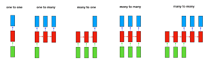

# 🔁 What is RNN (1 লাইনে reminder)

RNN এমন এক ধরনের neural network যা **previous time-step এর information (memory)** ব্যবহার করে **current output** তৈরি করে।

---

# 📌 Main Types of RNN (Sequential Overview)

RNN মূলত **input–output sequence structure** অনুযায়ী পর্যায়ক্রমে ভাগ করা হয়:

## Part A: Input-Output Structure Based (পর্যায় ১-৫)

1. **One-to-One** — একটি input, একটি output
2. **One-to-Many** — একটি input থেকে অনেক output
3. **Many-to-One** — অনেক input থেকে একটি output
4. **Many-to-Many (Same Length)** — সমান দৈর্ঘ্যের sequence
5. **Many-to-Many (Different Length)** — আলাদা দৈর্ঘ্যের sequence (Encoder-Decoder)

## Part B: RNN Cell Type Based (পর্যায় ৬-৯)

6. **Vanilla RNN** — সবচেয়ে সাধারণ RNN cell
7. **LSTM** — Long Short-Term Memory (সবচেয়ে শক্তিশালী)
8. **GRU** — Gated Recurrent Unit (LSTM এর সরল সংস্করণ)
9. **Bidirectional RNN** — দ্বিমুখী RNN (এগিয়ে + পিছনে)

---



---
## 1️⃣ One-to-One RNN

👉 Traditional Neural Network (RNN না হলেও baseline)

### Structure

```
Input → Output
```

### Example

* Image → Label (Cat / Dog)
* Exam marks → Pass / Fail

❌ এখানে **sequence নেই**, তাই RNN দরকার হয় না

---

## 2️⃣ One-to-Many RNN

👉 **একটা input → অনেক output (sequence)**

### Structure

```
Input → Output₁ → Output₂ → Output₃ → ...
```

### Real-Life Examples

* **Image Captioning**

  * Input: একটি ছবি
  * Output: “A boy is playing football”
* **Music generation**

  * Input: starting note
  * Output: full music sequence 🎵

### Why RNN?

প্রতিটা word / note আগেরটার উপর depend করে

---

## 3️⃣ Many-to-One RNN

👉 **অনেক input → একটা output**

### Structure

```
Input₁ → Input₂ → Input₃ → Output
```

### Real-Life Examples

* **Sentiment Analysis**

  * Input: “I love this movie”
  * Output: Positive 👍
* **Spam Detection**

  * Email text → Spam / Not Spam

👉 পুরো sentence পড়ার পর final decision নেয়

---

## 4️⃣ Many-to-Many RNN (Same Length)

👉 Input sequence length = Output sequence length

### Structure

```
Input₁ → Output₁
Input₂ → Output₂
Input₃ → Output₃
```

### Real-Life Examples

* **POS Tagging**

  * Input: “I love NLP”
  * Output: Pronoun Verb Noun
* **Named Entity Recognition (NER)**

👉 প্রতিটা word এর জন্য একটা label

---

## 5️⃣ Many-to-Many (Different Length)

### 🔥 Encoder–Decoder RNN (Seq2Seq)

### Structure

```
Encoder: Input₁ → Input₂ → Input₃ → Context Vector
Decoder: Context → Output₁ → Output₂ → Output₃ → Output₄
```

### Real-Life Examples

* **Machine Translation**

  * Input: “I love you”
  * Output: “আমি তোমাকে ভালোবাসি”
* **Speech to Text**
* **Text Summarization**

👉 Input ও Output length আলাদা হতে পারে

---

# 🧠 Based on RNN Cell Type

## 6️⃣ Vanilla RNN (Simple RNN)

### Equation

$$h_t = tanh(W_h h_{t-1} + W_x x_t)$$

### Problem ❌

* Vanishing Gradient
* Long-term memory ধরে রাখতে পারে না

---

## 7️⃣ LSTM (Long Short-Term Memory) ⭐⭐⭐

👉 সবচেয়ে powerful traditional RNN

### Gates

1️⃣ Forget Gate
2️⃣ Input Gate
3️⃣ Output Gate

### Why LSTM?

* Long-term dependency ধরে রাখতে পারে
* Vanishing gradient problem solve করে

### Example

* Language translation
* Stock price prediction
* Speech recognition

---

## 8️⃣ GRU (Gated Recurrent Unit)

👉 LSTM এর simpler version

### Gates

* Update Gate
* Reset Gate

### Advantages

✅ Faster than LSTM
✅ Less parameters
❌ Slightly less expressive

---

## 9️⃣ Bidirectional RNN (Bi-RNN)

👉 Sequence **forward + backward** দুই দিক থেকেই পড়ে

### Structure

```
← hₜ   hₜ →
```

### Example

* Speech recognition
* NER
* POS tagging

👉 Future context জানা থাকলে accuracy বাড়ে

---

# 📊 Quick Comparison Table

| Type        | Memory | Complexity | Best Use            |
| ----------- | ------ | ---------- | ------------------- |
| Vanilla RNN | ❌      | Low        | Short sequences     |
| LSTM        | ✅✅     | High       | Long sequences      |
| GRU         | ✅      | Medium     | Faster training     |
| Bi-RNN      | ✅✅     | High       | Context-aware tasks |

---

# 🔚 Final Summary

* **RNN types** বোঝা মানে → **problem অনুযায়ী architecture নির্বাচন**
* NLP, Time-Series, Speech → LSTM / GRU
* Translation → Encoder-Decoder
* Tagging → Many-to-Many

---